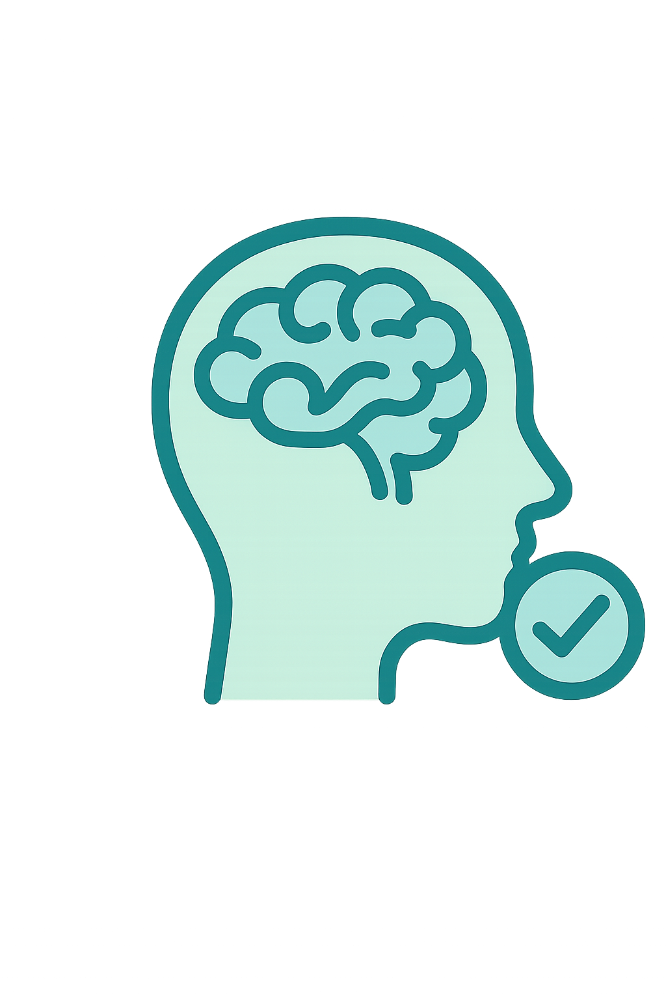

# 🧠 Cuide+ - Sistema de Agendamento Psicológico
 
Sistema web moderno para gestão de consultas psicológicas, desenvolvido com React 19 + Vite, focado em atendimentos voluntários em universidades, ONGs e projetos sociais.
 

 
[](CHANGELOG.md)
[](https://reactjs.org/)
[](https://vitejs.dev/)
[](https://tailwindcss.com/)
 
## 📋 Índice
 
- [Sobre o Projeto](#sobre-o-projeto)
- [Funcionalidades](#funcionalidades)
- [Tecnologias](#tecnologias)
- [Instalação](#instalação)
- [Uso](#uso)
- [Estrutura do Projeto](#estrutura-do-projeto)
- [API Mock](#api-mock)
- [Chat com IA](#chat-com-ia)
- [Componentes](#componentes)
- [Rotas](#rotas)
- [Design System](#design-system)
 
## 🎯 Sobre o Projeto
 
O **Cuide+** é uma plataforma web desenvolvida para facilitar o agendamento e gestão de consultas psicológicas em ambientes de atendimento voluntário. O sistema oferece interfaces diferenciadas para psicólogos e pacientes, com foco na experiência do usuário e eficiência operacional.
 
### Objetivos
 
- Simplificar o processo de agendamento de consultas
- Facilitar a gestão de pacientes para psicólogos
- Fornecer relatórios e analytics para acompanhamento
- Manter histórico completo de sessões
- Garantir interface moderna e responsiva
 
## ✨ Funcionalidades
 
### 👨‍⚕️ Para Psicólogos
 
- **Dashboard Personalizado**: Visão geral com KPIs e próximos agendamentos
- **Gestão de Pacientes**: Lista completa com informações detalhadas
- **Detalhes do Paciente**: Histórico de sessões, anotações e relatórios
- **Gestão de Sessões**: Edição de status, anotações e relatórios clínicos
- **Chat com IA**: Assistente especializada em psicologia clínica
- **Relatórios e Analytics**: Gráficos de frequência, status e alertas de risco
- **Agenda Individual**: Controle de disponibilidade por psicólogo
 
### 👤 Para Pacientes
 
- **Dashboard Simples**: Próximos agendamentos e informações relevantes
- **Agendamento Flexível**: Escolha de psicólogo, data e horário
- **Seleção de Especialista**: Lista de psicólogos com especialidades
- **Verificação de Disponibilidade**: Horários livres em tempo real
 
### 🔐 Sistema de Autenticação
 
- Login seguro com validação
- Diferenciação automática de perfis (psicólogo/paciente)
- Duas interfaces de login (padrão e moderna com glassmorphism)
- Registro de novos usuários com validação
- Contexto global de autenticação
- Proteção de rotas por perfil
 
## 🛠 Tecnologias
 
### Frontend
- **React 19.1.1** - Biblioteca principal
- **Vite 7.1.0** - Build tool e dev server
- **React Router DOM 7.8.0** - Roteamento
- **Tailwind CSS 4.1.11** - Framework CSS moderno
- **Framer Motion 12.23.12** - Animações fluidas
- **Lucide React 0.539.0** - Ícones modernos
- **Recharts 3.1.2** - Gráficos e visualizações
- **Chart.js 4.5.0** - Gráficos alternativos
- **React Hot Toast 2.5.2** - Notificações
- **@huggingface/inference 4.6.1** - Integração com IA
 
### Persistência
- **LocalStorage** - Armazenamento local dos dados
- **Mock API** - Simulação de backend
 
### Design
- **Glassmorphism** - Efeitos visuais modernos
- **Design System** - Paleta de cores consistente
- **Responsivo** - Mobile-first approach
 
## 🚀 Instalação
 
### Pré-requisitos
 
- Node.js 18+
- npm ou yarn
 
### Passos
 
1. **Clone o repositório**
```bash
git clone https://github.com/eliseu244/projeto_PsiAgenda
cd sistema-agendamento-psicologico
```
 
2. **Instale as dependências**
```bash
npm install
# ou
yarn install
```
 
3. **Configure as variáveis de ambiente**
```bash
cp .env.example .env
# Edite o arquivo .env e adicione seu token do Hugging Face
```
 
4. **Execute o projeto**
```bash
npm run dev
# ou
yarn dev
```
 
5. **Acesse no navegador**
```
http://localhost:5173
```
 
## 💻 Uso
 
### Contas de Teste
 
#### Psicólogos
- **Dr. João Silva**: `psicologo@test.com` / `123456` - Psicologia Clínica
- **Dra. Ana Costa**: `ana@test.com` / `123456` - Terapia Cognitivo-Comportamental
- **Dr. Carlos Mendes**: `carlos@test.com` / `123456` - Psicologia Infantil
- **Dra. Lucia Ferreira**: `lucia@test.com` / `123456` - Terapia Familiar
 
#### Paciente
- **Maria Santos**: `paciente@test.com` / `123456`
 
### Fluxo de Uso
 
1. **Login**: Acesse com uma das contas de teste
2. **Dashboard**: Visualize informações relevantes ao seu perfil
3. **Navegação**: Use a sidebar para acessar diferentes seções
4. **Agendamento** (Pacientes): Escolha psicólogo, data e horário
5. **Gestão** (Psicólogos): Gerencie pacientes e sessões
 
## 📁 Estrutura do Projeto
 
```
src/
├── components/              # Componentes reutilizáveis
│   ├── Button.jsx           # Botão customizado com variantes
│   ├── Card.jsx             # Container com glassmorphism
│   ├── FormSelect.jsx       # Select customizado
│   ├── Input.jsx            # Input com validação e show/hide password
│   ├── KPICard.jsx          # Card de KPI (ex: sessões, pacientes)
│   ├── LoadingSpinner.jsx   # Spinner de carregamento
│   ├── MarkdownRenderer.jsx # Renderizador de markdown para IA
│   ├── PublicNavbar.jsx     # Navbar para páginas públicas
│   ├── Sidebar.jsx          # Sidebar adaptativa para usuários autenticados
│   ├── TextArea.jsx         # Campo de texto multilinha com estilização
│   ├── TextBlock.jsx        # Bloco de texto com título e conteúdo
│   └── Footer.jsx           # Rodapé da aplicação
├── context/                 # Contextos React
│   └── AuthContext.jsx      # Contexto de autenticação
├── pages/                   # Páginas da aplicação
│   ├── About.jsx            # Página sobre o projeto
│   ├── Agendamentos.jsx     # Sistema de agendamento (pacientes)
│   ├── ChatIA.jsx           # Chat com IA especializada (psicólogos)
│   ├── DashboardPaciente.jsx# Dashboard para pacientes
│   ├── DashboardPsicologo.jsx# Dashboard para psicólogos
│   ├── Home.jsx             # Página inicial pública
│   ├── Login.jsx            # Login padrão
│   ├── NotFound.jsx         # Página 404 personalizada
│   ├── PacienteDetalhes.jsx # Detalhes e histórico do paciente
│   ├── Pacientes.jsx        # Lista de pacientes (psicólogos)
│   ├── Register.jsx         # Cadastro de usuários
│   ├── Relatorios.jsx       # Relatórios e analytics (psicólogos)
│   └── SessaoDetalhes.jsx   # Detalhes e gestão de sessões
├── routes/                  # Configuração de rotas
│   └── AppRoutes.jsx        # Rotas principais protegidas/públicas
├── services/                # Serviços e APIs
│   ├── aiService.js         # Serviço de IA
│   └── mockApi.js           # API mockada
├── App.jsx                  # Componente principal da aplicação
├── index.css                # Estilos globais (Tailwind)
└── main.jsx                 # Entry point da aplicação
```
 
## 🔌 API Mock
 
### Estrutura da API
 
A API mockada simula um backend real com as seguintes funcionalidades:
 
#### Autenticação
- `login(email, password)` - Autenticação de usuário
- `register(userData)` - Registro de novo usuário
 
#### Usuários
- `getPsychologists()` - Lista psicólogos disponíveis
 
#### Pacientes
- `getPatients(psychologistId)` - Lista pacientes do psicólogo
 
#### Agendamentos
- `getAppointments(userId, userType)` - Lista agendamentos
- `createAppointment(appointmentData)` - Criar agendamento
- `getAvailableSlots(date, psychologistId)` - Horários disponíveis
- `updateAppointment(id, data)` - Atualizar agendamento
- `cancelAppointment(id)` - Cancelar agendamento
 
#### Sessões
- `getSessionDetails(sessionId)` - Detalhes da sessão
- `updateSessionStatus(sessionId, status)` - Atualizar status
- `updateSessionNotes(sessionId, notes, report)` - Atualizar anotações
 
#### Relatórios
- `getReportsData(psychologistId)` - Dados para relatórios
 
### Persistência
 
Os dados são armazenados no `localStorage` do navegador:
 
- `lunysse_users` - Usuários do sistema
- `lunysse_patients` - Pacientes cadastrados
- `lunysse_appointments` - Agendamentos e sessões
 
## 🤖 Chat com IA
 
### Funcionalidades
 
- **Assistente Especializada**: IA treinada em psicologia clínica
- **Respostas Estruturadas**: Formatação markdown para melhor legibilidade
- **Histórico de Conversa**: Contexto mantido durante a sessão
- **Tratamento de Erros**: Mensagens informativas para problemas de conexão
- **Interface Moderna**: Design consistente com o sistema
 
### Configuração
 
1. **Token do Hugging Face já configurado**:
   - O projeto já possui um token configurado no arquivo `.env`
   - Para usar seu próprio token, substitua o valor em `VITE_HF_TOKEN`
 
2. **Modelo Utilizado**:
   - **Provider**: Novita
   - **Modelo**: zai-org/GLM-4.5
   - **Especialização**: Psicologia clínica
   - **Parâmetros**: max_tokens: 1500, temperature: 0.7
 
3. **Funcionalidades da IA**:
   - Respostas formatadas em markdown
   - Contexto de conversa mantido (últimas 10 mensagens)
   - Orientações baseadas em evidências científicas
   - Tratamento de erros específicos (token inválido, rate limit, conexão)
 
### Exemplos de Uso
 
- "Como lidar com pacientes com ansiedade?"
- "Técnicas para terapia infantil"
- "Abordagens para terapia de casal"
- "Sinais de alerta em depressão"
- "Orientações sobre aspectos éticos"
 
### Componentes
 
#### `ChatIA.jsx`
- Interface principal do chat
- Gerenciamento de mensagens e estado
- Integração com o serviço de IA
 
#### `MarkdownRenderer.jsx`
- Renderização de markdown nas respostas
- Formatação de títulos, listas e código
- Estilos consistentes com o design system
 
#### `aiService.js`
- Integração com Hugging Face Inference API
- Tratamento de erros e timeouts
- Configuração de parâmetros do modelo
 
## 🎨 Design System
 
### Paleta de Cores
 
```css
:root {
  --color-dark: #1B8387;       /* Azul bem escuro */
  --color-medium: #A5D9D2;     /* Azul médio */
  --color-light: #A5D9D2;      /* Azul claro */
  --color-accent: #26B0BF;     /* Azul/acento esverdeado */
  --color-background: #A5D9D2; /* Bege claro para fundo */
}
```
 
### Tipografia
 
- **Primária**: Inter (títulos e interface)
- **Secundária**: Nunito (textos corridos)
- **Monospace**: Roboto Mono (códigos)
 
### Componentes Base
 
#### Button
- Variantes: primary, secondary, danger
- Estados: normal, hover, loading, disabled
- Tamanhos: sm, md, lg
 
#### Card
- Glassmorphism effect
- Sombras suaves
- Bordas arredondadas
 
#### Modal
- Overlay com blur
- Animações de entrada/saída
- Responsivo
 
### Breakpoints
 
```css
sm: 640px
md: 768px
lg: 1024px
xl: 1280px
2xl: 1536px
```
 
## 🧩 Componentes
 
### Componentes de UI
 
#### `<Button />`
Botão customizado com variantes e estados.
 
```jsx
<Button variant="primary" size="lg" loading={isLoading}>
  Confirmar
</Button>
```
 
#### `<Card />`
Container com efeito glassmorphism.
 
```jsx
<Card className="p-6">
  <h2>Título do Card</h2>
  <p>Conteúdo...</p>
</Card>
```
 
#### `<Modal />`
Modal responsivo com overlay.
 
```jsx
<Modal isOpen={isOpen} onClose={handleClose} title="Título">
  <p>Conteúdo do modal...</p>
</Modal>
```
 
#### `<MarkdownRenderer />`
Renderizador de markdown para mensagens da IA.
 
```jsx
<MarkdownRenderer content={markdownText} />
```
 
### Componentes de Layout
 
#### `<Sidebar />`
Navegação lateral para usuários autenticados.
 
#### `<PublicNavbar />`
Navbar para páginas públicas.
 
### Componentes de Utilidade
 
#### `<LoadingSpinner />`
Indicador de carregamento com tamanhos variados.
 
## 🛣 Rotas
 
### Rotas Públicas
- `/` - Página inicial
- `/about` - Sobre o projeto
- `/login` - Login padrão    - `/chat-ia` - Chat com IA (apenas psicólogos)
- `/lunysse` - Login moderno
- `/register` - Cadastro    - `/pacientes` - Lista de pacientes (apenas psicólogos)
 
### Rotas Protegidas
- `/dashboard` - Dashboard (redireciona por tipo de usuário)
- `/agendamento` - Agendamento (apenas pacientes)
- `/chat-ia` - Chat com IA (apenas psicólogos)
- `/solicitacoes` - solicitacoes (apenas psicólogos)
- `/pacientes` - Pacientes (apenas psicólogos)
- `/pacientes/:id` - Detalhes do paciente
- `/relatorios` - Relatórios (apenas psicólogos)
- `/sessao/:sessionId` - Detalhes da sessão
 
### Proteção de Rotas
 
```jsx
const ProtectedRoute = ({ children }) => {
  const { user, loading } = useAuth();
 
  if (loading) return <LoadingSpinner />;
  if (!user) return <Navigate to="/login" />;
 
  return (
    <div className="min-h-screen flex">
      <Sidebar />
      <main className="flex-1 lg:ml-64 p-8">
        {children}
      </main>
    </div>
  );
};
```
 
## 📊 Funcionalidades Avançadas
 
### Sistema de Relatórios
 
- **KPIs Dinâmicos**: Calculados em tempo real
- **Gráficos Interativos**: Recharts para visualizações
- **Alertas de Risco**: Baseados em padrões de comportamento
- **Dados Históricos**: Análise temporal de sessões
 
### Chat com IA Especializada
 
- **Assistente Inteligente**: IA especializada em psicologia clínica
- **Respostas Estruturadas**: Formatação markdown automática
- **Contexto Mantido**: Histórico de conversa preservado
- **Sugestões Inteligentes**: Perguntas pré-definidas para facilitar uso
- **Tratamento de Erros**: Feedback claro sobre problemas de conexão
 
### Gestão de Agenda
 
- **Disponibilidade Individual**: Cada psicólogo tem sua agenda
- **Conflito de Horários**: Prevenção automática
- **Horários Flexíveis**: Configuração de slots disponíveis
- **Status de Sessões**: Controle completo do ciclo de vida
 
### Interface Responsiva
 
- **Mobile-First**: Design otimizado para dispositivos móveis
- **Sidebar Adaptativa**: Menu hambúrguer em telas pequenas
- **Cards Flexíveis**: Layout que se adapta ao conteúdo
- **Navegação Intuitiva**: UX consistente em todos os dispositivos
 
## 🔧 Scripts Disponíveis
 
```bash
# Desenvolvimento
npm run dev
 
# Build para produção
npm run build
 
# Preview da build
npm run preview
 
# Lint do código (ESLint 9.32.0)
npm run lint
 
# Instalar dependências
npm install
```
 
### Padrões de Código
 
- Use ESLint para manter consistência
- Siga os padrões do Prettier
- Componentes em PascalCase
- Funções em camelCase
- Constantes em UPPER_CASE
 
## 🔄 Versão Atual
 
**v1.0.0** - Sistema completo com todas as funcionalidades principais implementadas.
 
---
 
<div align="center">
  <p>Desenvolvido com amor para facilitar o acesso à saúde mental</p>
  <p><strong>Cuide+ v1.0.0 - Sistema de Agendamento Psicológico</strong></p>
  <p>React 19 • Vite 7 • Tailwind CSS 4 • Hugging Face AI</p>
</div>